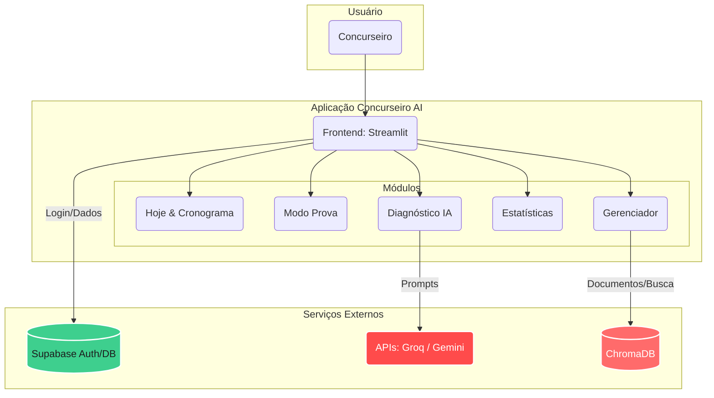

<div align="center">

# 🎯 Concurseiro AI
### Plataforma de Estudos Inteligente para maximizar seu desempenho.


</div>

---

## 🚀 Visão Geral

O **Concurseiro AI** é uma Plataforma de Estudos Inteligente desenvolvida para auxiliar concurseiros em sua jornada de preparação. A aplicação utiliza inteligência artificial para fornecer diagnósticos precisos, simulados adaptativos, estatísticas de desempenho e gerenciamento eficiente do cronograma de estudos.

O grande diferencial é transformar o estudo tradicional em um ecossistema orientado a dados, permitindo que o aluno acompanhe sua evolução de perto e identifique automaticamente pontos de melhoria com o auxílio de IA.

---

## 🏛️ Arquitetura do Sistema

A aplicação é construída de forma modular, com o frontend renderizado via Streamlit e integração contínua com banco de dados e APIs de IA no backend.



---

## ✨ Funcionalidades Principais

-   **📅 Hoje & Cronograma:** Painel diário de metas e ferramenta para organizar planos de estudos a longo prazo.
-   **📝 Modo Prova:** Ambiente para resolução de questões e simulados para testar conhecimentos de forma prática.
-   **🧠 Diagnóstico (IA):** Análise inteligente do seu desempenho. Usa modelos de IA (via Groq ou Gemini) para identificar pontos fortes e fracos.
-   **📊 Estatísticas:** Gráficos interativos e dados detalhados sobre evolução, erros e acertos.
-   **📂 Gerenciador:** Área completa para gerenciar materiais, disciplinas, tópicos e banco de questões local.

---

## ⚙️ Tecnologias Utilizadas

| Camada | Tecnologia | Propósito |
| :--- | :--- | :--- |
| **Frontend & App** | Streamlit | Interface de usuário interativa, responsiva e focada em dados. |
| **Backend & Auth** | Supabase | Gerenciamento de banco de dados relacional e autenticação de usuários. |
| **Inteligência Artificial** | LangChain, Groq, Gemini | Orquestração de prompts e geração de diagnósticos inteligentes. |
| **Busca Vetorial** | ChromaDB, Sentence-Transformers | Armazenamento de embeddings para busca semântica em materiais de estudo. |
| **Manipulação de Dados** | Pandas | Processamento e análise das estatísticas de desempenho do aluno. |

---

## 🛠️ Como Executar Localmente

Siga os passos abaixo para configurar e rodar o ambiente de desenvolvimento localmente.

### Pré-requisitos
* Python 3.8+
* Git

### 1. Clonar o Repositório
```bash
git clone https://github.com/CidQueiroz/concurseiroia.git
cd concurseiroia
```

### 2. Configurar o Ambiente Virtual

Recomenda-se criar um ambiente virtual para isolar as dependências:

```bash
python -m venv venv
# Linux/macOS:
source venv/bin/activate
# Windows:
venv\Scripts\activate
```

### 3. Instalar Dependências e Configurar Variáveis

```bash
pip install -r requirements.txt
```

Crie um arquivo `.env` na raiz do projeto contendo as chaves necessárias (ex: `SUPABASE_URL`, `SUPABASE_KEY`).

### 4. Executar a Aplicação

Inicie o servidor Streamlit:

```bash
streamlit run app.py
```
-   A aplicação estará disponível em `http://localhost:8501`.

---

## 🤖 Uso de IA e Chaves de API (BYOK)

O **Concurseiro AI** permite que você traga sua própria chave de API (Bring Your Own Key) para utilizar as funcionalidades de IA generativa.
No menu lateral, em **"⚙️ Chaves de API"**, você pode inserir suas próprias chaves para os provedores:
*   **Groq API Key:** Modelos rápidos e ultra-eficientes.
*   **Gemini API Key:** Modelos robustos do ecossistema Google.
*   *(Caso deixe em branco, o sistema buscará por chaves padrão configuradas no `.env`).*

## 🔒 Autenticação

O sistema conta com um módulo de autenticação integrado com o Supabase. Na tela inicial, os usuários podem:
*   Fazer login com E-mail e Senha.
*   Criar uma nova conta.
*   Manter a sessão salva através de cookies.

## 📁 Estrutura do Projeto

```text
/
├── app.py                 # Arquivo principal de execução do Streamlit
├── requirements.txt       # Dependências do projeto
├── .env                   # Variáveis de ambiente (não versionado)
├── backend/               # Configurações de banco de dados (Supabase)
├── modules/               # Módulos das páginas (hoje, modo_prova, etc.)
├── data/                  # Banco de dados local/sqlite e arquivos de dados
├── crawler/               # Scripts para raspagem de dados de questões
└── venv/                  # Ambiente virtual
```
---

<div align="center">
  <i>Desenvolvido para revolucionar a forma como você estuda para concursos! 📚🚀</i>
</div>
